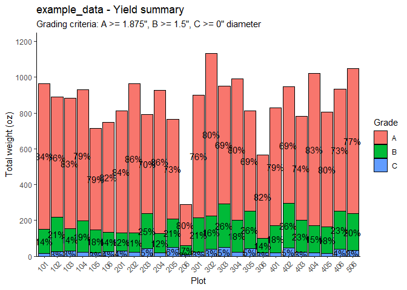
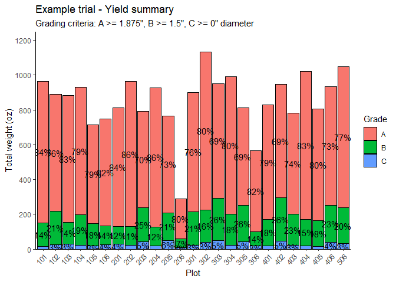
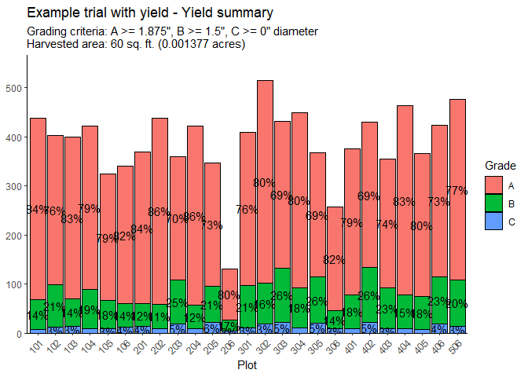
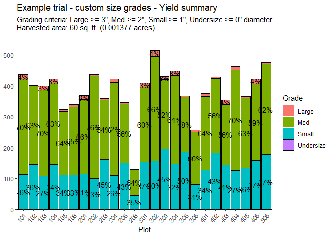
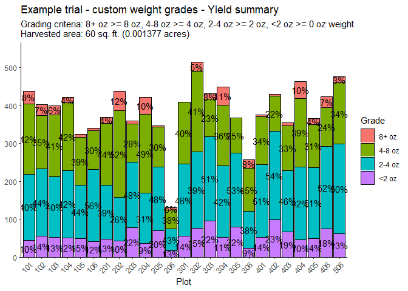

# Example Usage of agray Package

This document demonstrates how to use the agray grading functions for
grading potato tubers.

## Using default name and grading scheme

``` r
grade(file = "example_data.csv")
```

    ## 
    ## Cleaning input file...
    ## - Saved graded tuber list to: ./example_data/example_data - Graded tuber list.csv 
    ## 
    ## Getting plots...
    ## - As run: 402, 401, 305, 304, 203, 201, 102, 105, 101, 104, 202, 206, 306, 506, 303, 404, 406, 405, 403, 301, 302, 205, 204, 106, 103 
    ## - Sorted: 101, 102, 103, 104, 105, 106, 201, 202, 203, 204, 205, 206, 301, 302, 303, 304, 305, 306, 401, 402, 403, 404, 405, 406, 506 
    ## - Total plots: 25 
    ## 
    ## Getting cull weights...
    ## - Saved cull weights to: ./example_data/example_data - Cull weights.csv 
    ## 
    ## Summarizing dataset...
    ## - Total tubers: 7182 
    ## - Total weight: 1337 lbs.
    ## - Mean weight: 3 oz.
    ## - Proportion A: 63.1% 
    ## - Proportion B: 27.1% 
    ## - Proportion C: 9.8% 
    ## - Saved grading summary (long format) to: ./example_data/example_data - Grading summary (long format).csv 
    ## - Saved grading summary (wide format) to: ./example_data/example_data - Grading summary (wide format).csv 
    ## 
    ## Generating summary plot...

    ## - Saved plot image to: ./example_data/example_data - Yield summary.png

<!-- -->

    ## 
    ## Also saved to local environment: all_tubers, grade_summary, totals_summary, plt

This will output to a folder called ‘example_data’ within the current
project directory.

## Supplying your own trial name

``` r
grade(
  file = "example_data.csv",
  name = "Example trial"
)
```

    ## 
    ## Cleaning input file...
    ## - Saved graded tuber list to: ./Example trial/Example trial - Graded tuber list.csv 
    ## 
    ## Getting plots...
    ## - As run: 402, 401, 305, 304, 203, 201, 102, 105, 101, 104, 202, 206, 306, 506, 303, 404, 406, 405, 403, 301, 302, 205, 204, 106, 103 
    ## - Sorted: 101, 102, 103, 104, 105, 106, 201, 202, 203, 204, 205, 206, 301, 302, 303, 304, 305, 306, 401, 402, 403, 404, 405, 406, 506 
    ## - Total plots: 25 
    ## 
    ## Getting cull weights...
    ## - Saved cull weights to: ./Example trial/Example trial - Cull weights.csv 
    ## 
    ## Summarizing dataset...
    ## - Total tubers: 7182 
    ## - Total weight: 1337 lbs.
    ## - Mean weight: 3 oz.
    ## - Proportion A: 63.1% 
    ## - Proportion B: 27.1% 
    ## - Proportion C: 9.8% 
    ## - Saved grading summary (long format) to: ./Example trial/Example trial - Grading summary (long format).csv 
    ## - Saved grading summary (wide format) to: ./Example trial/Example trial - Grading summary (wide format).csv 
    ## 
    ## Generating summary plot...

    ## - Saved plot image to: ./Example trial/Example trial - Yield summary.png

<!-- -->

    ## 
    ## Also saved to local environment: all_tubers, grade_summary, totals_summary, plt

This will output to a folder called ‘Example trial’ within the current
project directory.

## Supplying the harvested area

``` r
grade(
  file = "example_data.csv",
  name = "Example trial with yield",
  area = 60
)
```

    ## 
    ## Cleaning input file...
    ## - Saved graded tuber list to: ./Example trial with yield/Example trial with yield - Graded tuber list.csv 
    ## 
    ## Getting plots...
    ## - As run: 402, 401, 305, 304, 203, 201, 102, 105, 101, 104, 202, 206, 306, 506, 303, 404, 406, 405, 403, 301, 302, 205, 204, 106, 103 
    ## - Sorted: 101, 102, 103, 104, 105, 106, 201, 202, 203, 204, 205, 206, 301, 302, 303, 304, 305, 306, 401, 402, 403, 404, 405, 406, 506 
    ## - Total plots: 25 
    ## 
    ## Getting cull weights...
    ## - Saved cull weights to: ./Example trial with yield/Example trial with yield - Cull weights.csv 
    ## 
    ## Summarizing dataset...
    ## - Total tubers: 7182 
    ## - Total weight: 1337 lbs.
    ## - Mean weight: 3 oz.
    ## - Proportion A: 63.1% 
    ## - Proportion B: 27.1% 
    ## - Proportion C: 9.8% 
    ## - Saved grading summary (long format) to: ./Example trial with yield/Example trial with yield - Grading summary (long format).csv 
    ## - Saved grading summary (wide format) to: ./Example trial with yield/Example trial with yield - Grading summary (wide format).csv 
    ## 
    ## Generating summary plot...

    ## - Saved plot image to: ./Example trial with yield/Example trial with yield - Yield summary.png

<!-- -->

    ## 
    ## Also saved to local environment: all_tubers, grade_summary, totals_summary, plt

Now the output files will include additional columns for calculated
yields.

## Custom tuber grades by size

``` r
# Remember the values are the minimum size for each class
size_grades <- list(
  "Large" = 3,
  "Med" = 2,
  "Small" = 1,
  "Undersize" = 0
)

grade(
  file = "example_data.csv",
  name = "Example trial - custom size grades",
  grades = size_grades,
  area = 60
)
```

    ## 
    ## Cleaning input file...
    ## - Saved graded tuber list to: ./Example trial - custom size grades/Example trial - custom size grades - Graded tuber list.csv 
    ## 
    ## Getting plots...
    ## - As run: 402, 401, 305, 304, 203, 201, 102, 105, 101, 104, 202, 206, 306, 506, 303, 404, 406, 405, 403, 301, 302, 205, 204, 106, 103 
    ## - Sorted: 101, 102, 103, 104, 105, 106, 201, 202, 203, 204, 205, 206, 301, 302, 303, 304, 305, 306, 401, 402, 403, 404, 405, 406, 506 
    ## - Total plots: 25 
    ## 
    ## Getting cull weights...
    ## - Saved cull weights to: ./Example trial - custom size grades/Example trial - custom size grades - Cull weights.csv 
    ## 
    ## Summarizing dataset...
    ## - Total tubers: 7182 
    ## - Total weight: 1337 lbs.
    ## - Mean weight: 3 oz.
    ## - Proportion Large: 1.3% 
    ## - Proportion Med: 48.2% 
    ## - Proportion Small: 50.2% 
    ## - Proportion Undersize: 0.3% 
    ## - Saved grading summary (long format) to: ./Example trial - custom size grades/Example trial - custom size grades - Grading summary (long format).csv 
    ## - Saved grading summary (wide format) to: ./Example trial - custom size grades/Example trial - custom size grades - Grading summary (wide format).csv 
    ## 
    ## Generating summary plot...

    ## - Saved plot image to: ./Example trial - custom size grades/Example trial - custom size grades - Yield summary.png

<!-- -->

    ## 
    ## Also saved to local environment: all_tubers, grade_summary, totals_summary, plt

## Custom tuber grades by weight

``` r
weight_grades <- list(
  "8+ oz" = 8,
  "4-8 oz" = 4,
  "2-4 oz" = 2,
  "<2 oz" = 0
)

grade(
  file = "example_data.csv",
  name = "Example trial - custom weight grades",
  grades = weight_grades,
  grade_by = "Weight",
  area = 60
)
```

    ## 
    ## Cleaning input file...
    ## - Saved graded tuber list to: ./Example trial - custom weight grades/Example trial - custom weight grades - Graded tuber list.csv 
    ## 
    ## Getting plots...
    ## - As run: 402, 401, 305, 304, 203, 201, 102, 105, 101, 104, 202, 206, 306, 506, 303, 404, 406, 405, 403, 301, 302, 205, 204, 106, 103 
    ## - Sorted: 101, 102, 103, 104, 105, 106, 201, 202, 203, 204, 205, 206, 301, 302, 303, 304, 305, 306, 401, 402, 403, 404, 405, 406, 506 
    ## - Total plots: 25 
    ## 
    ## Getting cull weights...
    ## - Saved cull weights to: ./Example trial - custom weight grades/Example trial - custom weight grades - Cull weights.csv 
    ## 
    ## Summarizing dataset...
    ## - Total tubers: 7182 
    ## - Total weight: 1337 lbs.
    ## - Mean weight: 3 oz.
    ## - Proportion 8+ oz: 1.6% 
    ## - Proportion 4-8 oz: 20.4% 
    ## - Proportion 2-4 oz: 46.0% 
    ## - Proportion <2 oz: 32.0% 
    ## - Saved grading summary (long format) to: ./Example trial - custom weight grades/Example trial - custom weight grades - Grading summary (long format).csv 
    ## - Saved grading summary (wide format) to: ./Example trial - custom weight grades/Example trial - custom weight grades - Grading summary (wide format).csv 
    ## 
    ## Generating summary plot...

    ## - Saved plot image to: ./Example trial - custom weight grades/Example trial - custom weight grades - Yield summary.png

<!-- -->

    ## 
    ## Also saved to local environment: all_tubers, grade_summary, totals_summary, plt
